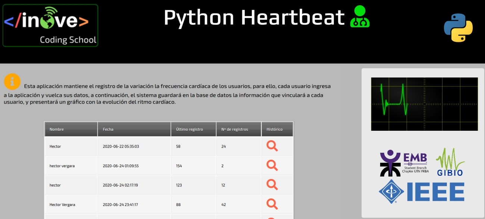
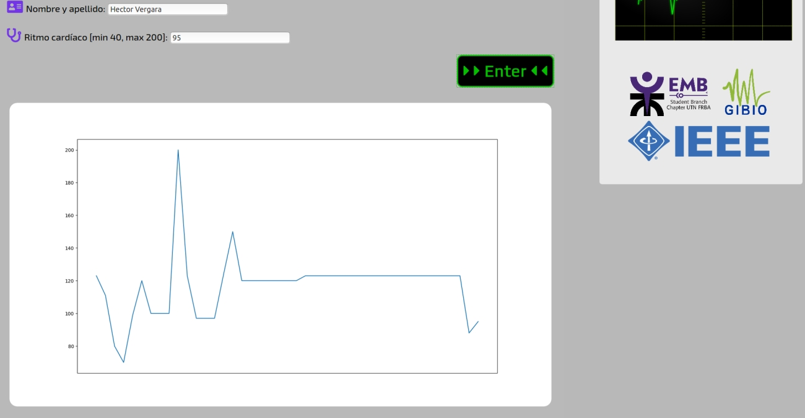

# :stethoscope:	Python Heartbeat
### Monitor cardiaco

Este es un proyecto realizado por miembros de inove, junto con integrantes de la "Engineering in Medicine and Biology Society" (EMB), es un grupo dentro de la IEEE dedicado al estudio de la ingeniería biomédica, y también con miembros de la Universidad Tecnológica Nacional (UTN).

# Comenzando 🚀
El objetivo de este proyecto es dar un ejemplo de aplicación de Python en ciencia e ingeniería. Se trata de un registro de ritmo cardíaco en donde los usuarios deben ingresar su nombre completo y número de pulsaciones por minuto (ppm), para ser guardados en una base de datos. También tendremos la posibilidad de envíar telemetría en tiempo real (vía MQTT) de un equipo que recolectará la frecuencia cardíaca de un paciente de prueba, para visualizarlo en tiempo real.

# Pre-requisitos 📋
Para poder ejecutar esta aplicación, será necesario tener instalada la versión 3.6 de Python o superior. También es necesario incluir varios módullos.
Recomendamos antes de descargar el repositorio, realizar los siguientes pasos:

```
pip3 install pip -U --upgrade
pip3 install numpy
pip  install matplotlib
pip  install mplcursors
pip3 install requests
pip3 install -U Flask
pip3 install -U scikit-learn
pip3 install pandas
pip  install paho-mqtt
```

# Instalación y pruebas 🔧⚙️
Descargue el repositorio en su pc y abra el proyecto en su editor de código, luego ejecute el archivo ```app.py```. La aplicación crea un servidor local en la dirección http://127.0.0.1:5000/ en donde tendremos alojado el frontend de nuestra aplicación. Las direcciónes para acceder a las páginas de la aplicación son:

- http://127.0.0.1:5000/monitor          # Pagina principal, allí podremos acceder a los datos de todos los usuarios registrados.
- http://127.0.0.1:5000/monitor/registro # Página en donde podremos ingresar el usuario (nuevo o existente) y la evolución de su ritmo cardíaco.
- http://127.0.0.1:5000/monitor/equipo   # Página que muestra el gráfico en tiempo real de la telemetría obtenída vía MQTT de un dispositivo.

# Construido con 🛠️
- Visual Studio Code (https://code.visualstudio.com/)
- Python 3.7 (https://www.python.org/)
- Mathplotlib (https://matplotlib.org/)
- Flask (https://flask.palletsprojects.com/)
- Pandas (https://pandas.pydata.org/)
- Scikit-learn (https://scikit-learn.org/)
- Paho (https://pypi.org/project/paho-mqtt/)
- Mplcursors (https://mplcursors.readthedocs.io/)
- NumPy (https://numpy.org/)

# Capturas :camera:
Pantalla de monitoreo:


Pantalla de registro:


# Autores ✒️
### Miembros de Inove (coding school)
:octocat: Hernán Contigiani 
:octocat: Hector Vergara

# Licencia 📄 :balance_scale:
Este proyecto está bajo la Licencia de Inove (coding school) para libre descarga y uso. Este proyecto tiene un propósito educativo y de muestra, por ello, no nos responsabilizaremos por su uso indebido. Así mismo, no existe garantía en su implementación debido a que se trata de una demostración de uso gratuito con propósitos educativos. 
### :copyright: Inove (coding school) 2020.

